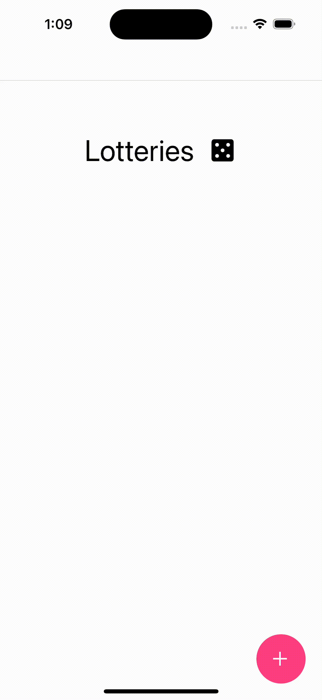
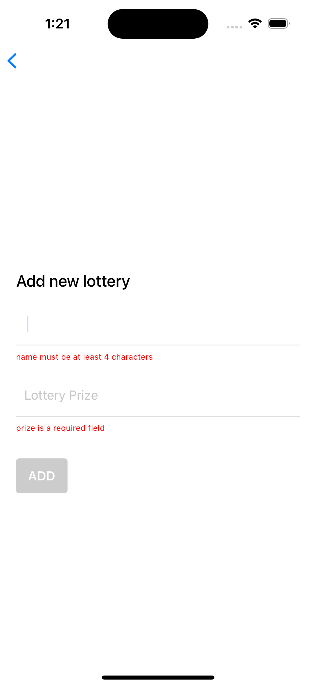
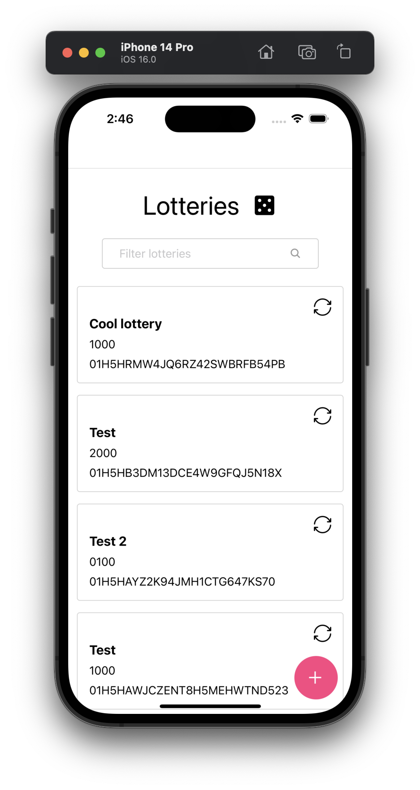
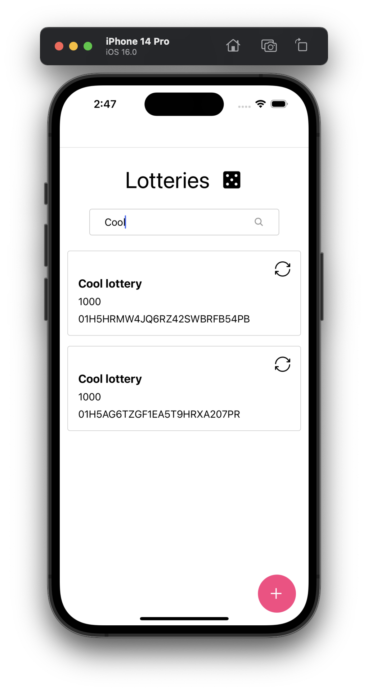
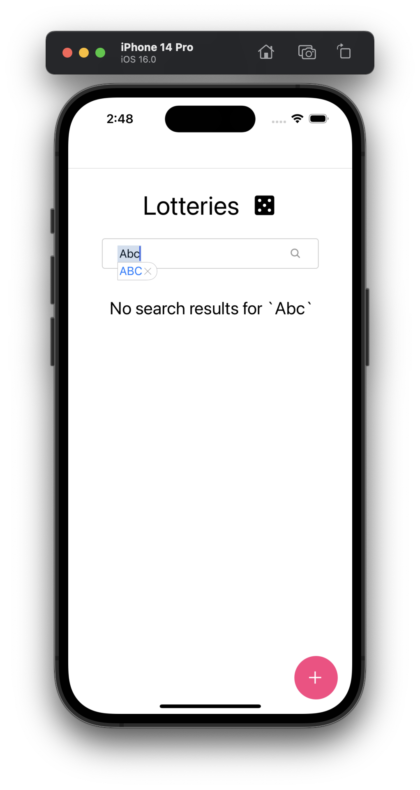
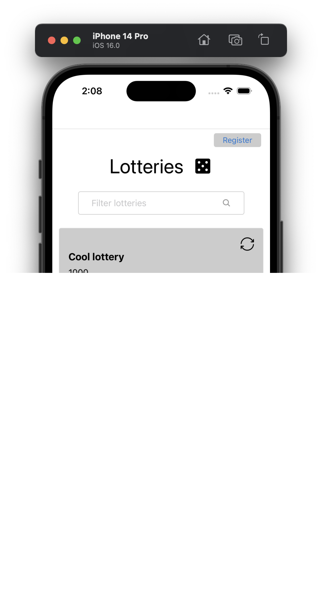

# Module 2 Homework

### Homework management :house:

The final result of all homework is the React Native Application full of features implemented iteratively in the end phase of each module in the course. In order to keep consistency and track all of your changes we highly recommend you to create your own GitHub repository where your work as a participant will be stored. Your GitHub repository should be shared with all trainers, which will enable us to verify your work and communicate:


Each module in the course will end up with homework consisting of a few tasks to fulfil. We would like to suggest a comfortable system for you to submit each task of the homework as a separate PR to the main branch in your repository. This will create a space for us to communicate with you, by doing code reviews - thanks to that we will be able to check your homework, discuss some uncertainties, or respond to questions you will leave in the PR. In case you have any trouble with homework you can always book a 1 to 1 session with the trainer, and also don't hesitate to ask your questions in the dedicated communication channel. Keep in mind that you don't have to worry about being blocked for the next homework, every homework will have a starting point, so you always will be able to override the content of your repository with the prepared starting point.

### The goal of this module’s homework

The goal of this homework is to build the mobile part of the Lotteries app. We will focus on specific features of React Native, such as navigation, core components, styling, lists, asyncStorage and animations.

### Starting point

You should be able to continue working on the same homework project but if you don’t have it available or you want to start fresh here is a starting point for this homework - 

https://github.com/callstack-workshops/questrade-module1-hw


### Checkpoints :bulb:

The homework repository contains periodic checkpoints for your convenience. You will see callouts denoting the current checkpoint throughout this instruction. They will look something like this:


Feel free to check out the corresponding branch of any given checkpoint if you’re struggling or simply want to compare your solution with ours.

With that out of the way, let’s start!

## Part 1: Project setup


<details>
  <summary><b>Step 1: Create new folder</b></summary><br>

Since we previously decided that our project will not be monorepo, let's just create a new folder called "mobile" and install our mobile part of the project there:

  ```bash
    mkdir mobile
  ```
</details>

<details>
  <summary><b>Step 2: Install new project with Expo</b></summary><br>

1. Run the following command in the root of the repository to create new expo project and TypeScript already setup. Choose `mobile` as the name of the application

  ```bash
    npx create-expo-app -t expo-template-blank-typescript
  ```

2. Navigate to the directory and run one of the following npm commands

```bash
 cd mobile
 npm run android
 npm run ios
``` 
3. Add the following script to the `package.json`:

```bash
{
  "scripts": {
    "tsc": "tsc"
  }
}
```

4. Then, to type-check the project, run the following command:
 ```bash
   npnm run tsc
```

</details>

<details>
  <summary><b>Step 3: Configure `eslint` and `prettier`</b></summary><br>

  1.Install necessary dependencies
  ```bash
    npm install --save-dev eslint @callstack/eslint-config
  ```

  2.Create configuration files for ESLint and Prettier:
  ```js
  // .eslintrc
  {
    "extends": "@callstack/eslint-config/node"
  }
  ```
  ```js
  // .prettierrc
  {
    "singleQuote": true,
    "trailingComma": "all"
  }
  ```


  3.Add the following script to the package.json
  ```json
    {
      "scripts": {
        "lint": "eslint ."
      }
    }
  ```

<b>Congratulations. You already set your mobile project!</b>

You can read more about TS configuration with expo here: https://docs.expo.dev/guides/typescript/

</details>


## Part 2: Add a lottery

<details>
  <summary>In this part we will implement the given UI:</summary> 

  


</details>

1. Install react navigation: https://reactnavigation.org/docs/hello-react-navigation
2. Create native stack navigator: https://reactnavigation.org/docs/hello-react-navigation
3. Add two screens: `Home` and `AddLottery`
4. Create `FAB` and `Form` components
5. You can reuse and copy `useNewLottery` hook from web part
6. Add form validation:
  <details>
    <summary>Form validation</summary>
    
  

    
  </details>


Add lottery feature should have following things implemented:

- FAB button to navigate to new screens
- New “Add lottery screen” with add new lottery form
- Forms should be validated (implement the same functionality as on web)
- Loading state should be present when form is submitted
- After successful submission we should be navigated back to Home Screen and Toast with a `'New lottery added successfully!'` message should be displayed

  

## Part 3: List lotteries

Given the UI design implement List lotteries feature. 

<details>
  <summary><b>Fetch and display lottery data</b></summary><br>




</details>

<details>
  <summary><b>Add text input to filter fetched lotteries</b></summary><br>




</details>

<details>
  <summary><b>Handle no search result case</b></summary><br>




</details>


List lotteries feature:

- Should display list off lotteries  ( you can copy and reuse `useLotteries` hook from the web part
- Adding a new lottery should re-fetch the lotteries
- Loading state should be present while fetching the lotteries
- Should have text input to with a search icon
- Typing in the input should filter the results
- When there are no search results for a given filter, no search result information should be displayed


## Part 4: Store register lottery data


<details>
  <summary><b>Make lotteries selectable and add `Register` button</b></summary><br>
  


</details>

<details>
  <summary><b>Add register modal with name input and validation:</b></summary><br>


</details>

<details>
  <summary>Registered lotteries:</summary>



  
</details>

Registered lotteries feature:

- Lotteries should be selectable by pressing on them
- Register button should open a modal to register for selected lotteries
- Register button should be disabled when no lotteries are selected
- Register modal should close after successful submission and registered lottery IDs need to be added to AsyncStorage
- Registered lotteries should be grayed-out and not be selectable


## Part 5: Add animation

<details>
  <summary>In this part we will implement header animation as following:</summary>


  
</details>

Adding animations feature:

- Implement a collapsible header animation that smoothly transitions the header's height as the user scrolls down the list
- Add an animation to change the opacity of the header as the user scrolls down the list.
- Apply an animation to scale down the header elements as the user scrolls down.


